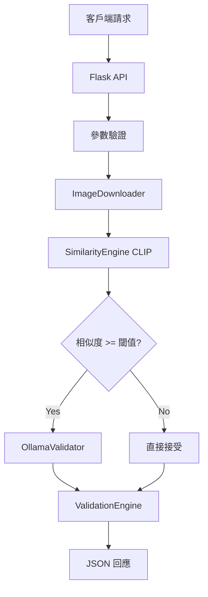

# PictureQA Flask API - 圖片語義驗證服務

基於 CLIP 模型和 Ollama 多模態驗證的圖片語義分析 API 服務，專為 N8N 工作流程和其他自動化系統設計。提供高效的圖片下載、語義相似度分析和現實性驗證功能。

## 🌟 主要功能

### 核心 API 功能
- 🔗 **RESTful API**: 標準 HTTP API 介面，易於整合
- 🖼️ **圖片 URL 處理**: 支援網路圖片 URL 和內網地址
- 🎯 **語義相似度分析**: 基於 CLIP ViT-B-32 模型
- 🤖 **現實性驗證**: 整合 Ollama phi4-mini 多模態檢測
- ⚡ **高效處理**: 單張圖片 2-10 秒處理時間
- 🛡️ **錯誤處理**: 完整的錯誤回應和日誌記錄

### 驗證能力
- 📊 **語義匹配**: 計算圖片與文字提示的相似度分數
- 🔍 **物理合理性**: 檢測浮空物體、重力違反等問題
- 🏷️ **浮水印識別**: 過濾含有版權標記的圖片
- 📰 **文字內容檢測**: 識別不當的印刷文字覆蓋
- 🎚️ **可調節閾值**: 靈活配置相似度和信心度閾值

## 🏗️ 架構設計



### 技術棧
- **後端框架**: Flask + CORS
- **AI 模型**: 
  - OpenCLIP (ViT-B-32) - 語義相似度
  - Ollama (phi4-mini) - 現實性驗證
- **圖片處理**: PIL + requests
- **資源管理**: 自動清理 GPU 記憶體和臨時檔案
- **部署目標**: Mac/Linux 伺服器 (支援 Windows 測試)

## 📦 快速安裝

### 1. 環境需求
- Python 3.8+
- 8GB+ RAM (建議 16GB)
- GPU 支援 (可選，用於加速)
- Ollama 服務 (可選，用於現實性驗證)

### 2. 安裝步驟

```bash
# 克隆專案 (切換到 FlaskVersion 分支)
git clone -b FlaskVersion https://github.com/your-repo/pictureQA.git
cd pictureQA

# 安裝 Python 依賴
pip install -r requirements.txt

# 安裝 Ollama (可選)
# 訪問 https://ollama.ai 下載安裝
ollama pull phi4-mini

# 啟動服務
python app.py
```

### 3. 驗證安裝

```bash
# 檢查 API 健康狀態
curl http://localhost:5000/health

# 執行測試套件
python test_api.py        # 基礎 API 測試
python simple_test.py     # 簡化功能測試
```

## 🚀 API 使用指南

### 端點說明

#### 1. 健康檢查
```http
GET /health
```

**回應範例:**
```json
{
  "status": "healthy",
  "service": "PictureQA API",
  "version": "1.0.0",
  "timestamp": "2025-07-01T12:00:00.000Z"
}
```

#### 2. 圖片驗證 (主要端點)
```http
POST /api/v1/validate
Content-Type: application/json
```

**請求參數:**
```json
{
  "image_url": "https://example.com/image.jpg",
  "prompt": "A cat sitting on a table",
  "similarity_threshold": 0.38,
  "ollama_enabled": true,
  "confidence_threshold": 0.7
}
```

**參數說明:**
- `image_url` (必填): 圖片 URL，支援網路和內網地址
- `prompt` (必填): 英文描述文字
- `similarity_threshold` (可選): CLIP 相似度閾值，預設 0.38
- `ollama_enabled` (可選): 是否啟用 Ollama 驗證，預設 true
- `confidence_threshold` (可選): Ollama 信心度閾值，預設 0.7

**成功回應範例:**
```json
{
  "success": true,
  "image_url": "https://example.com/cat.jpg",
  "prompt": "A cat sitting on a table",
  "parameters": {
    "similarity_threshold": 0.38,
    "ollama_enabled": true,
    "confidence_threshold": 0.7
  },
  "image_info": {
    "width": 800,
    "height": 600,
    "format": "JPEG",
    "size_bytes": 156789
  },
  "download_info": {
    "status": "success",
    "processing_time": 0.85,
    "message": "下載成功"
  },
  "clip_analysis": {
    "similarity_score": 0.7234,
    "status": "success",
    "processing_time": 0.65
  },
  "ollama_validation": {
    "enabled": true,
    "status": "normal",
    "confidence": 0.92,
    "details": "Image appears physically realistic...",
    "processing_time": 2.34
  },
  "final_status": "accepted",
  "total_processing_time": 3.84,
  "timestamp": "2025-07-01T12:00:00.000Z"
}
```

**錯誤回應範例:**
```json
{
  "success": false,
  "error": "image_download_failed",
  "message": "無法下載指定的圖片",
  "image_url": "https://invalid-url.com/image.jpg",
  "timestamp": "2025-07-01T12:00:00.000Z"
}
```

### 狀態碼說明
- `200`: 處理成功
- `400`: 客戶端錯誤 (參數錯誤、URL 無效等)
- `404`: 端點不存在
- `500`: 伺服器內部錯誤

## 🔧 配置說明

編輯 `config.yaml` 自訂服務設定：

```yaml
# CLIP 模型配置
model:
  name: "ViT-B-32"
  pretrained: "laion2b_s34b_b79k"
  device: "auto"  # auto, cpu, cuda

# Ollama 配置
ollama:
  enabled: true
  model_name: "phi4-mini"
  api_url: "http://localhost:11434"
  timeout: 30
  default_prompt: |
    Analyze this image for quality and realism issues...

# 處理設定
processing:
  max_image_size: 1024
  supported_formats: [".png", ".jpg", ".jpeg", ".webp"]
  cache_enabled: true

# API 設定
api:
  host: "0.0.0.0"
  port: 5000
  debug: false
  cors_enabled: true
```

## 🐳 Docker 部署

### Dockerfile
```dockerfile
FROM python:3.11-slim

WORKDIR /app
COPY requirements.txt .
RUN pip install -r requirements.txt

COPY . .
EXPOSE 5000

CMD ["python", "app.py"]
```

### Docker Compose
```yaml
version: '3.8'
services:
  pictureqa-api:
    build: .
    ports:
      - "5000:5000"
    environment:
      - FLASK_ENV=production
    volumes:
      - ./config.yaml:/app/config.yaml
      - ./data:/app/data
```

## 🔗 N8N 整合範例

### N8N 工作流程節點

```json
{
  "nodes": [
    {
      "parameters": {
        "url": "http://localhost:5000/api/v1/validate",
        "sendBody": true,
        "bodyParameters": {
          "parameters": [
            {
              "name": "image_url",
              "value": "={{ $json.image_url }}"
            },
            {
              "name": "prompt",
              "value": "A realistic photo"
            },
            {
              "name": "similarity_threshold",
              "value": 0.4
            }
          ]
        }
      },
      "name": "PictureQA Validation",
      "type": "n8n-nodes-base.httpRequest"
    }
  ]
}
```

## 📊 效能指標

### 處理時間基準 (單張圖片)
| 組件 | CPU 模式 | GPU 模式 |
|------|----------|----------|
| 圖片下載 | 0.3-2s | 0.3-2s |
| CLIP 分析 | 2-5s | 0.5-1s |
| Ollama 驗證 | 3-8s | 2-5s |
| **總計** | **5-15s** | **3-8s** |

### 記憶體使用
| 組件 | 記憶體需求 |
|------|------------|
| CLIP 模型 | ~2GB |
| Ollama (phi4-mini) | ~2GB |
| API 服務 | ~500MB |
| **總計** | **~4.5GB** |

## 🛠️ 開發工具

### 測試腳本
```bash
# API 基礎測試
python test_api.py

# 實際驗證測試  
python test_real_validation.py

# 資源管理測試
python test_resource_management.py

# 特定 URL 測試
python test_specific_url.py
```

### Ollama 管理
```bash
# 檢查 Ollama 狀態
python manage_ollama.py status

# 停止 Ollama 服務
python manage_ollama.py stop

# 重啟 Ollama 服務  
python manage_ollama.py restart
```

## 🔍 故障排除

### 常見問題

#### 1. 啟動時間過長
**原因**: 首次啟動需下載 CLIP 模型 (~600MB)
**解決**: 耐心等待或使用預建立的 Docker 映像

#### 2. Ollama 連接失敗
**檢查步驟**:
```bash
# 確認 Ollama 服務運行
curl http://localhost:11434/api/tags

# 檢查模型是否安裝
ollama list

# 重啟 Ollama 服務
python manage_ollama.py restart
```

#### 3. 記憶體不足
**優化建議**:
- 調整 `config.yaml` 中的 `max_image_size`
- 使用 CPU 模式而非 GPU
- 增加系統交換檔案大小

#### 4. 內網圖片無法存取
**檢查**:
- 確認 URL 格式正確
- 檢查網路連通性
- 驗證內網防火牆設定

### 日誌分析

服務日誌包含詳細的處理資訊：
```
2025-07-01 12:00:00 - INFO - 開始驗證圖片: https://example.com/image.jpg
2025-07-01 12:00:01 - INFO - 圖片下載成功: 156789 bytes (0.85s)
2025-07-01 12:00:02 - INFO - CLIP 分析完成: 相似度 0.7234 (0.65s)
2025-07-01 12:00:04 - INFO - Ollama 驗證完成: normal (2.34s)
2025-07-01 12:00:04 - INFO - 驗證完成，結果: accepted
```

## 📈 擴展性考量

### 水平擴展
- 使用負載均衡器分散請求
- 部署多個 API 實例
- 共享模型快取目錄

### 效能優化
- 使用 Redis 快取驗證結果
- 實施請求佇列系統
- 使用更強大的 GPU 硬體

### 監控建議
- 使用 Prometheus + Grafana 監控
- 設置 API 回應時間警報
- 監控記憶體和 GPU 使用率

## 🤝 貢獻指南

1. Fork 專案並切換到 `FlaskVersion` 分支
2. 建立功能分支: `git checkout -b feature/new-feature`
3. 撰寫測試並確保通過
4. 提交變更: `git commit -m 'Add new feature'`
5. 推送分支: `git push origin feature/new-feature`
6. 建立 Pull Request

## 📝 版本歷史

### v2.1.0 (FlaskVersion Branch) - 2025-07-01
- 🎉 **Flask API 重構**: 完整的 RESTful API 服務
- 🔗 **N8N 整合**: 專為工作流程自動化設計
- 🛡️ **資源管理**: 完善的記憶體和連接清理
- 🌐 **內網支援**: 支援內網 IP 地址和 localhost
- 📊 **效能優化**: 張量清理和 GPU 快取管理
- 🧪 **完整測試**: API、功能和資源管理測試套件
- 🔧 **服務管理**: Ollama 服務控制工具

## 📄 授權協議

MIT License - 詳見 [LICENSE](LICENSE) 檔案

## 🙏 致謝

- [OpenCLIP](https://github.com/mlfoundations/open_clip) - CLIP 模型實現
- [Ollama](https://ollama.ai/) - 本地多模態模型服務
- [Flask](https://flask.palletsprojects.com/) - 輕量級 Web 框架
- [N8N](https://n8n.io/) - 工作流程自動化平台

---

**🚀 專為生產環境設計的圖片語義驗證 API，現在就整合到你的自動化工作流程中！** 